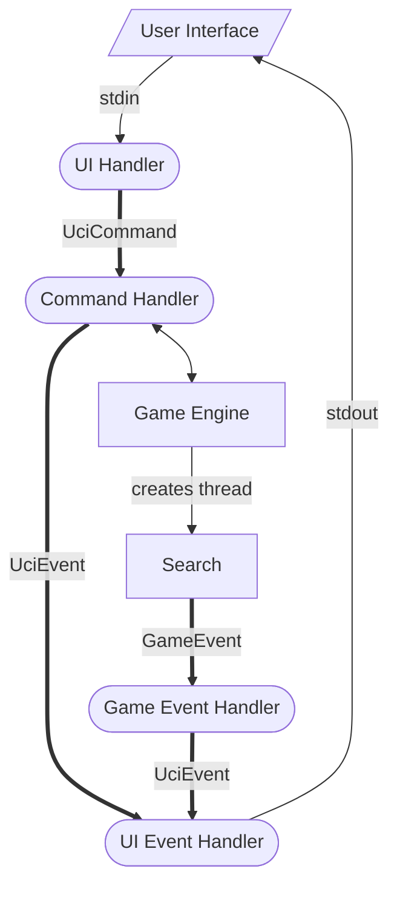

# Architecture

To handle the communication with the user interface, Kaik uses several threads that communicate over channels.

- UI Handler: Reads the UCI text commands from standard input and converts them into an `UciCommand` message.
- UI Event Handler: Handles `UciEvent` messages by converting them to a string printed to the standard output.
- Command Handler: Processes the `UciCommand` and calls the engine. If the call to the engine is synchronous (i.e. fast) it may send a response to the UI by sending a `UciEvent` message. This runs actually in the main thread and holds a reference onto the game.
- Game Event Handler: The engine and search may send `GameEvent` messages (best move, info), which are processed by the Game Event Handler. This handler converts them to `UciEvent`.

